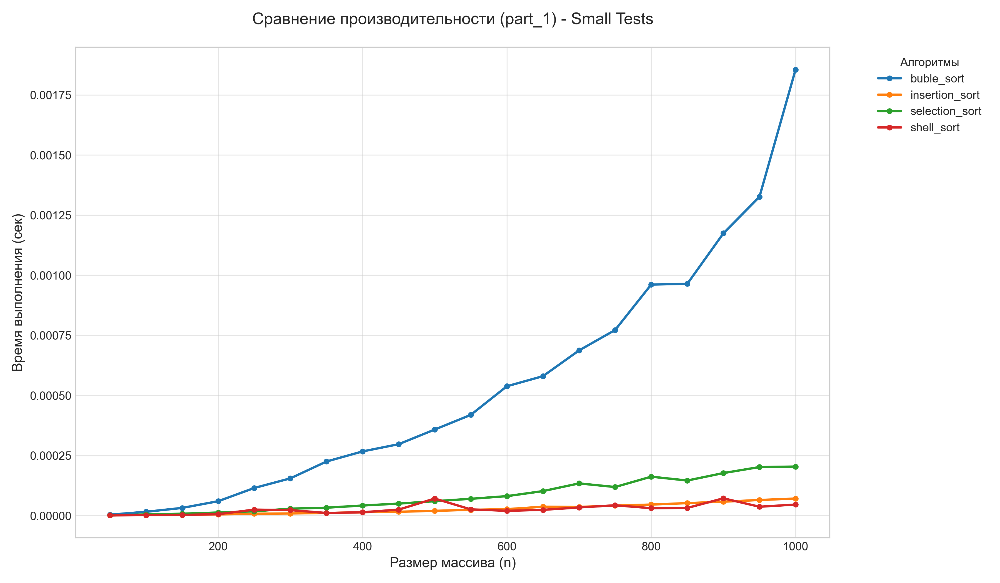
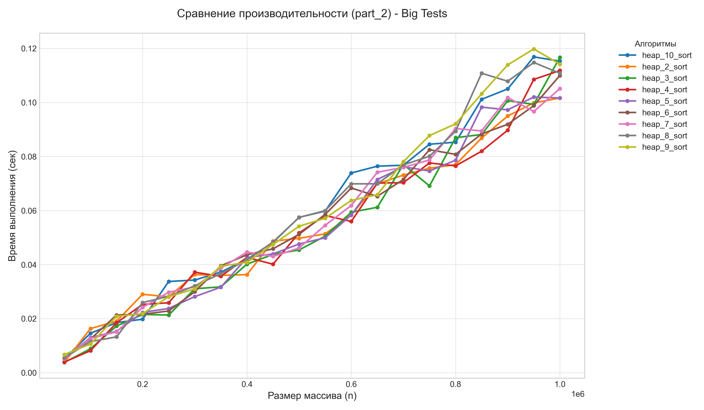
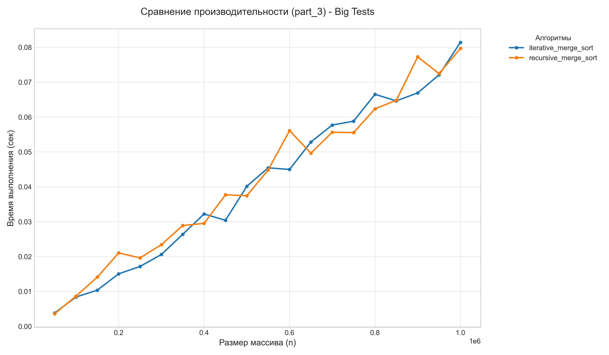
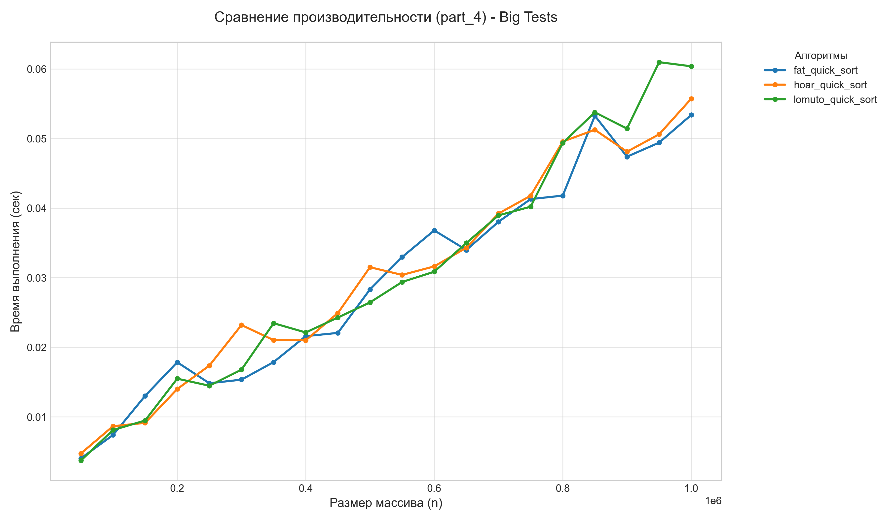
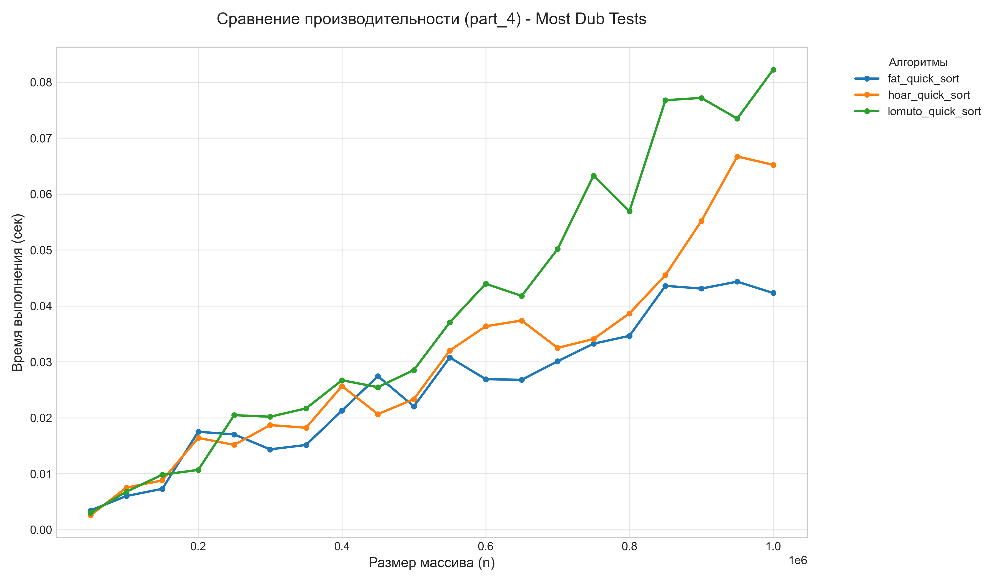
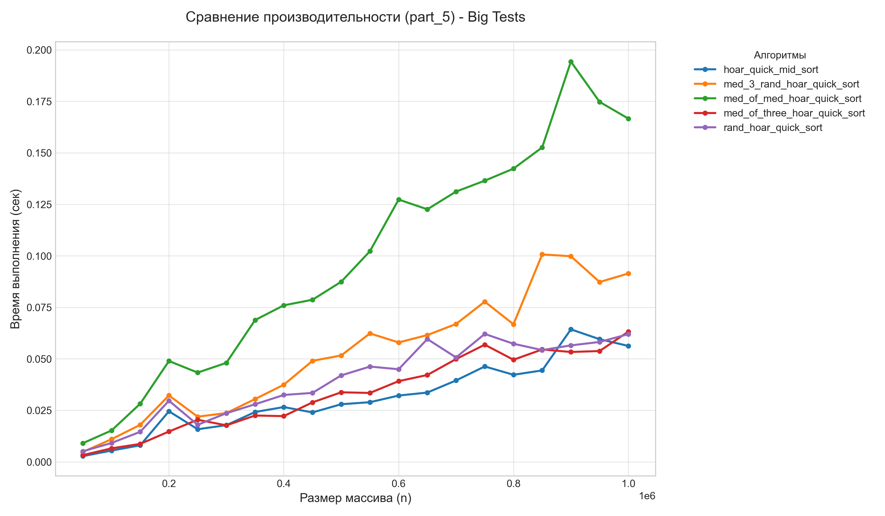
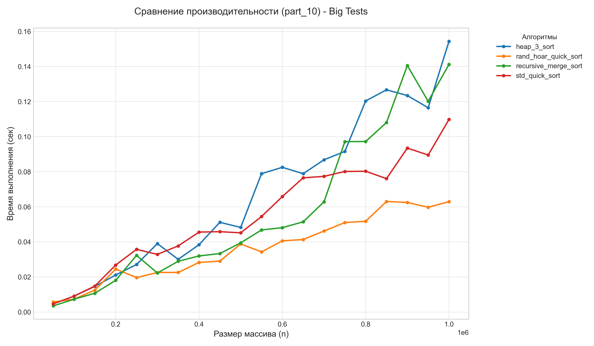

# Сравнительный анализ алгоритмов сортировки

## Оглавление

* [Цель работы](#цель-работы)
* [Структура проекта](#структура-проекта)
* [Запуск](#запуск)
* [Реализации](#реализации)
* [Итог](#итог)

---

## Цель работы

Сравнение времени работы алгоритмов сортировки при разных входных данных (размер массива, дубликатов) и поиск оптимальных стратегий выбора опорного элемента.

---

## Структура проекта

* `scripts/` — скрипты генерации одной серии тестов, по переданным параметрам и генерации всех трех серий тестов
* `src/gen` — в этой папке лежат сами генераторы тестов и ответов на них
* `src/sorts` — реализации всех сортировок
* `src/test` — реализация функций тестирования
* `src/parts` — сам тестирующий файл, выполняет тестирование тех партов, какие переданы в качестве флагов например: --part_1 выполнит замеры которые требовались в первом парте
* `plotter.py` — рисует графики и сохраняет в папку time_res в подпапки part

---

## Запуск

```makefile
make all         # Компиляция генератора и тестора и тд
make gen_tests   # Генерация тестов
make run_all     # Запуск тестирования всех партов в моем случае 1-5 и 10
make run_part_N  # Запуск тестов для конкретного парта прим. run_part_1
make plot        # Рисует графики
make clean_all   # Полная очистка проекта
make clean_ob    # Чистит бинарники и объектники
make clean_res   # Чистит результаты времени партов
make clean_tests # Чистит нагенеренные тесты
make clean_plot  # Чистит графики
```

## Реализации

### 1. Квадратичные (и не совсем) сортировки

* Лучше всего себя показали shell и insertion sort. selection sort чуть хуже, а бабл ну это бабл.

<p align="center">
  
</p>

### 2. Пирамидальные сортировки

* На больших тестах все примерно одинаково работают, нет тех кто сильно выделяется, но луше всего себя показала сортировка кучей, с k = 3, хоть и с супер маленьким отрывом

<p align="center">
  
</p>


### 3. Сортировка слиянием 

* Итеративная и реккурсивная работают примерно одинаково , но итеративная чуть стабильнее. Это  связано с отсутствием накладных расходов на рекурсию (сохранение в стек и тд)

<p align="center">
  
</p>

### 4. Быстрые сортировки (партиционирования и оптимизации)

* Ломуто в обоих тестах роботает хреново, это связано большим количеством лишних перестановок , а хоар выигрывает. При этом толстый во втором тесте, как и ожидается обгрняет хоара.

<p align="center">
  
</p>

<p align="center">
  
</p>

### 5. Быстрые сортировки (разные стратегии выбора, прочее)

* Я написал все стратегии выбора плюс медиана медиан. медиана межиан медленне всех из-за большого количества доп операций . быстрее всех сработал выбор среднего , но при учете что массив случайный, а так вывигрывает рандомный выбор, вместе с медианой трех.  Для каких стратегий можно придумать киллер-массивы?  для центрального как раз можно подобрать массив где в центре миримальный элемент и алгоритм будет работатть за квадрат, аналогично для медианы трех. Мединана медиан хуже всех изза накладных расходов

<p align="center">
  
</p>

## Итог

### 10. Вывод

* Квадратичные сортировки: На малых данных все сортировки кроме пузырька идут на равне и сильно его обгоняют, за счет меньшего количества инверсий.

* Пирамидальные сортировки: По итогу получилоось, что для k-ичной кучи оптимальным значением является k = 3. Это обеспечивает лучший баланс между глубиной дерева (количеством уровней) и количеством сравнений при поиске максимального потомка в узле, хотя сильной разницы нет.

* Слияние и QuickSort: Итеративная версия Merge Sort показала небольшое преимущество над рекурсивной на большом количестве данныъ, из-за экономии на вызовах функций и работе со стеком. В быстрых сортировках Хоар и Толстое разбиение опережают схему Ломуто. 

* Стратегии выбора: «Медиана медиан», не смотря на то что даже в худшем случае асимптоика это n log n, она оказалась самой медленной среди быстрых сортировок из-за больштх накладных расходов. На случайных данных наиболее эффективным оказался выбор центрального элемента, однако для защиты  наиболее надежным выбором будет рандомного элемента.

* Сравнение с qsort
Догнали ли стандартный qsort?
Наша быстрая сортировка с Хоаром и случайным элементом оказалась быстрее. Тем не менее, библиотечный qsort стабильнее так как внутри он реализует гибридные подходы.

<p align="center">
  
</p>

* Процессор 12th Gen Intel(R) Core(TM) i5-12450H (2.00 GHz) 


