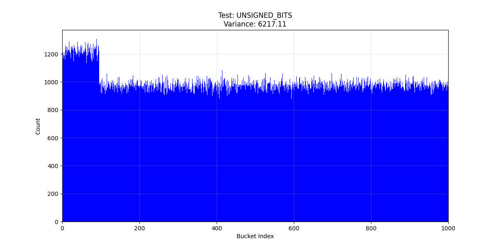
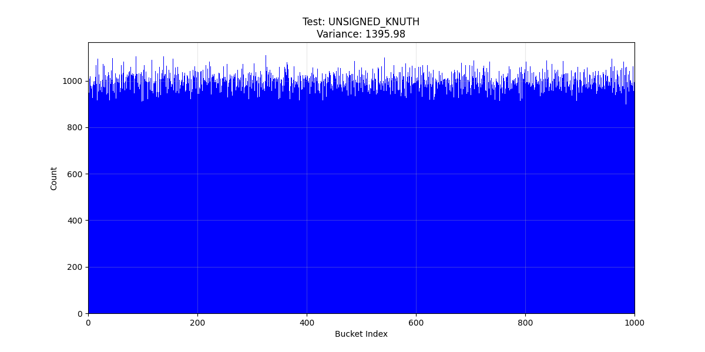
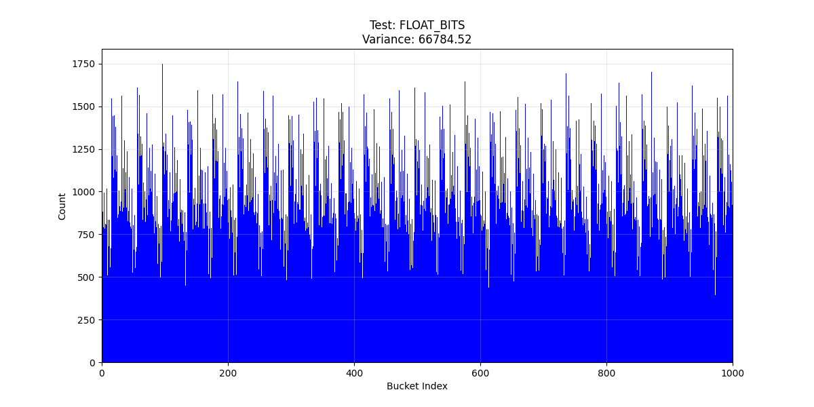
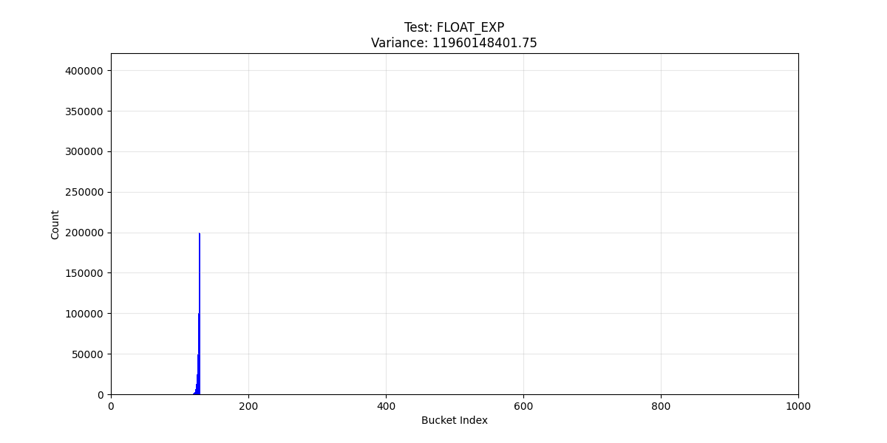
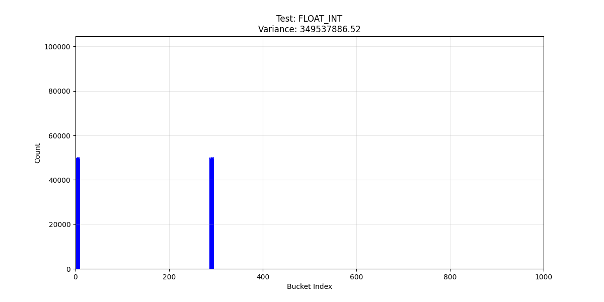
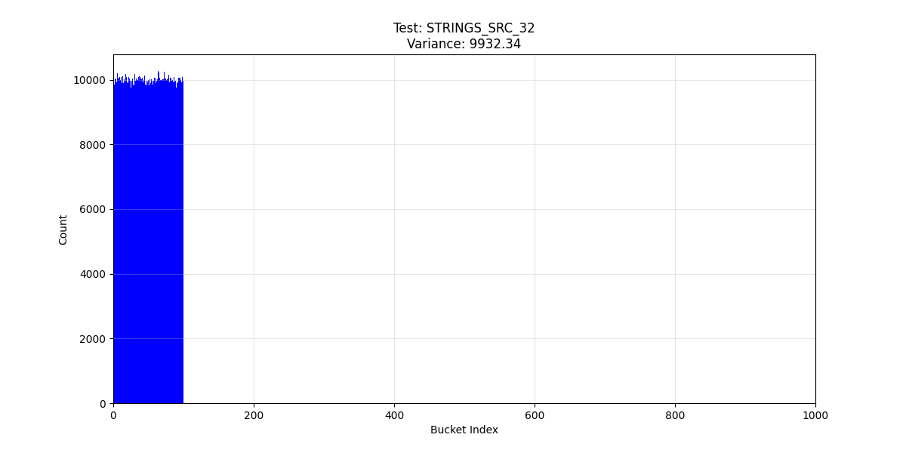
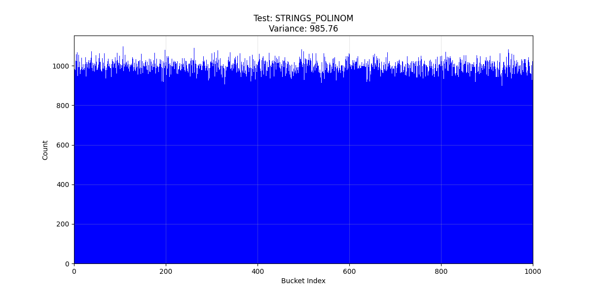
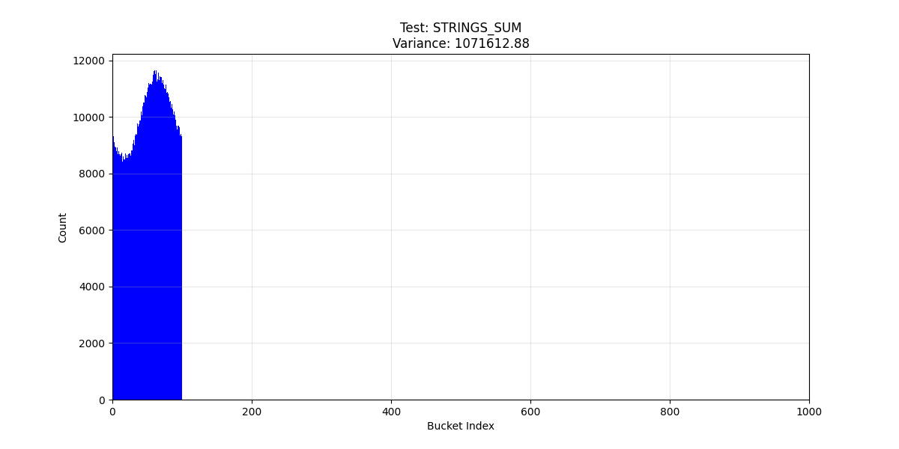
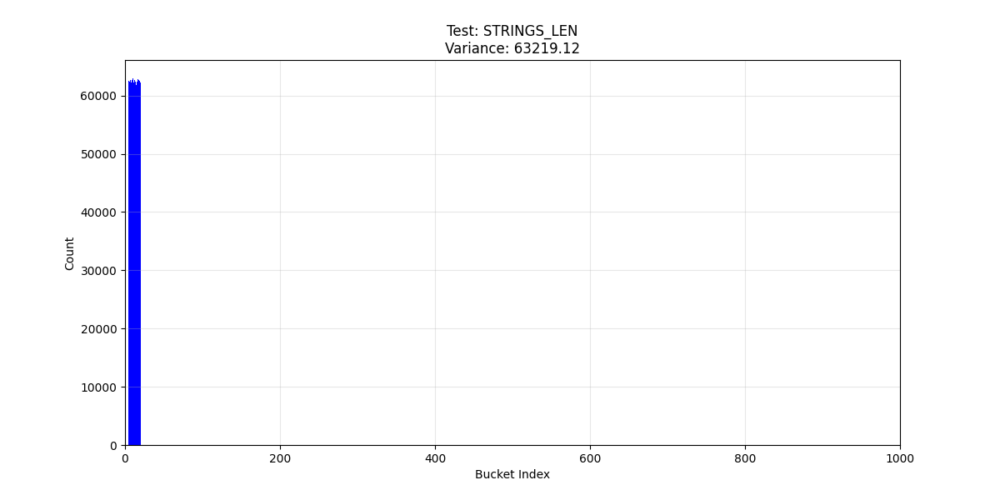

# Сравнение Хэш функций и скорости работы хэш таблиц

## Оглавление

* [Цель работы](#цель-работы)
* [Структура проекта](#структура-проекта)
* [Реализации](#реализации)
* [Тестирование](#тестирование)
* [Запуск](#запуск)
* [Итог](#итог)

---

## Цель работы

Сравнить какие Хэш функции лучше всего работают, т.е какие дают наиболее равномерное распределение, у каких их них наименьшая дисперсия. Так же сравним разные виды хэш таблиц. Точнее их скорость работы и оптимальный Load factor для них

---

## Структура проекта

* `/bin` — тут лежат экзешники, а точнее будет один, который при запуске с разными флагами, будет проводить тесты для всех пунктов.
* `/src` — реализации фунций хэширования и хэш таблиц.
* `/res` — результаты тестирования для первых трех пунктов про хэш функции. То есть количество коллизий для каждой ячейки хэш таблицы.
* `/tests` — реализации тестировочного файла и генератора тестов.
* `/include` — заголовочные файлы.
* `/plots` — графики.
* `plotter.py` — рисует графики.


---

## Реализации

### 1. Хэш  функции для работы с unsigned int

Самый худший результат у битового представления, на графике виден горб, да и дисперсия самая большая - 6217.

<p align="center">
  
</p>

Остальные две функции идут примерно на равне: Кнут и просто остаток от деления. Однако остаток чуть более равномерный.

<p align="center">
  
</p>

<p align="center">
  
</p>

### 2. Хэш  функции для работы с float

Тут лучше всего себя показало битовое представление. Самая норм функция.

<p align="center">
  
</p>

У остальных ужасная дисперсия и выглядят как иголки. Самое худшее распределение у преведения инту и распределения по экспоненте.

<p align="center">
  
</p>

<p align="center">
  
</p>

Крч нельзя хэшировать флоты потому, что появляется проблема ,что при близких значениях в действительности, влоты очень сильно будут отличаться в битовом представлении. Т.е 0.1 + 0.2 и 0.3 будет разный хэш. Да и распределение там не случайное, а кучковатое изза чего проблемно хэшировать.

---

### 3. Хэш  функции для работы с string

Тут лучше всего себя показали две функции: crc32 и полиномиальное хэширование. Они прям на равне идут. Я думаю срц по тому что отлично мешает биты, а полиномиальное, по тому что там хэширование зависит от номера символа и от того что получаются большие числа, которые сложно предугадать


<p align="center">
  
</p>


<p align="center">
  
</p>

Далее как бы волнами идет сумма символов. Тут как раз изза отсутсвия зависимости от ноомера символа

<p align="center">
  
</p>

и Худшее это длина строки. Ну тут очевно

<p align="center">
  
</p>


---
## Тестирование

Все тесты сделаны на вставке миллиона элементов в таблицу размером 1000. Тфблица - цепочками.

---


## Запуск

```bash
# Сборки
make release     # Релиз (-O3, -flto и тд)
make debug       # Дебаг (Варнинги, санитайзеры и тд)

# Тесты (генерация логов в res/)
make part_1        # Unsigned int
make part_2        # Float
make part_3        # String
make run_part_1_3  # Все тесты по очереди

make plot          # Построить графики из res/

make clean         # Удалить obj/, bin/, res/, venv/, doc/
make clean_obj     # Удалить только .o файлы
make clean_plots   # Удалить только /plots

```


## Итог

Для чисел: Обычный остаток от деления или метод Кнута — самые адекватные варианты. Битовые сдвиги работают плохо, создают кучу лишних коллизий там, где их быть не должно.

Для строк: Полиномиальный хэш и CRC32 — топ. Они учитывают порядок букв, поэтому строки типа "abc" и "cba" не дают одно и тоже. Хэшировать по длине или сумме символов — бесполезно, на больших данных таблица просто превращается в список.

Про флоты: Главный вывод — лучше их вообще не хэшировать. Даже «лучшая» функция для флотов дает разброс в разы хуже, чем для интов. Из-за специфики хранения float в памяти и проблем с точностью (типа 0.1 + 0.2 != 0.3) хэш-таблица на них получается нестабильной и медленной.


как то так