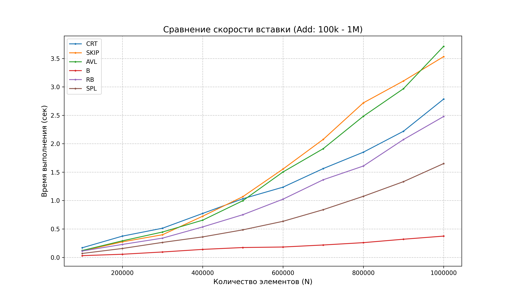
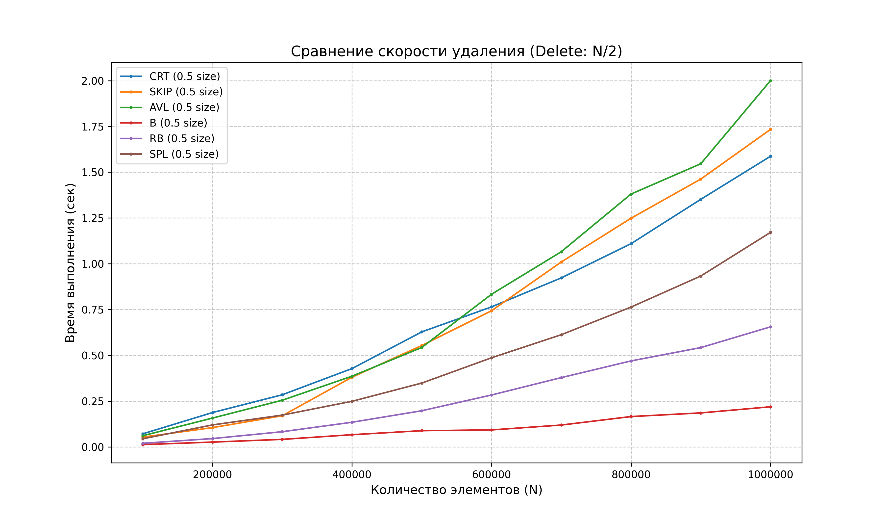

# Сравнение Деревьев 

Деревья: Наивное дерево, AVL, Декартово дерево, Splay-дерево, КЧ дерево, B-дерево

## Оглавление

* [Цель работы](#цель-работы)
* [Структура проекта](#структура-проекта)
* [Реализации](#реализации)
* [Тестирование](#тестирование)
* [Запуск](#запуск)
* [Итог](#итог)

---

## Цель работы

Сравнить какие деревья быстрее всего всего работают

---

## Структура проекта

* `/bin` — тут лежат экзешники, а точнее будет один, который при запуске с разными флагами и путями, будет проводить тесты для всех пунктов.
* `/src/forest` — реализации деревьев.
* `/src/testing` — реализации тестирующей системы.
* `/res` — результаты тестирования для всех деревьев.
* `/include` — заголовочные файлы.
* `/plots` — графики.
* `plotter.py` — рисует графики.


---

## Реализации

### Деревья

(небольшая поправочка, в процессе графики перерисовывались, так что места каких то деревьев могут не соответствовать картинке, но большой разницы все рано нет)

Сначала вот графики

<p align="center">
  
</p>

И

<p align="center">
  
</p>

Самый лучший результат у Б дерева, А худший у Декартача.

А теперь пройдемся по каждому дереву. 

#### 1. B-Tree
* **Почему выиграл** Потому что Кэш Френдли. Работает с разу с пачками памяти. В отличие от остальных не прыгает по одному узлу, этот проходится по блокам и за счет этого выигрывает. 
#### 2. RB и AVL 
* **Кратко** Идут плотно, но **RB-tree** чуть шустрее на удалении, потому что не так сильно парится за идеальную ровность, как **AVL**.

#### 3. SKIP
* **Кратко** Список с пропусками. Работает на рандоме. Удивительно, но держится на уровне AVL. Норм но далеко не так быстро как Б дерево

### 4. SPL и CRT
* **SPL:** На графике виден горб и какая то дисперсия . Из-за того что постоянно тащит элементы вверх, на рандомных данных это жрет время на лишние перестроения.
* **CRT:** Самый худший результат вместе со Сплеем. Теоретически вроде нормалным быть должно было, но анлак.

### 4. BST
* **Кратко** Ну и про Бинарное дерево поиска, графика нет, но там как и ожидается , в худшем случае, когда массив отсортирован, работает очень долго даже на 10000 элементах

---
## Тестирование

Все тесты кроме BST сделаны на вставке от 100 000 до 1 000 000 элементов и удаления половины. 
 
---


## Запуск

```bash
make                 # Скомпилировать проект изначально режим debug
make run_all         # Запустить тесты для всех деревьев
make run_b           # Запустить тест только для B-дерева аналогично для run_avl, run_rb и тд
make plots           # venv и отрисовка графиков , результаты в /plots

make run_all MODE=release  # Тесты, в  релизной версии, только перед прогоном удалить все бинарники и тд

make clean           # Удалить объектники, бинарник и результаты тестов в res/
make clean_venv      # Снести виртуальное окружение питона
make clean_plots     # Удаление графиков
```


## Итог

### 1. B-Tree Absolute cinema
* **Итог:** Самое лучшее из всех из-за того что кэш френдли . Лучший выбор.

### 2. AVL и RB
* **Итог:** Хорошие, стабильные деревья, но до  B-tree  еще далеко.

### 3. Splay и CRT
* **Итог:** В обоих слишком много лишних накладных расходов и действий. Поэтому худший вариант

### Общий итог
B-дерево побеждает потому, что умнее всех работает с памятью. Так что если структура не кэш френдли то даже с крутой логикой может слить другой, которая будет кэш френдли.